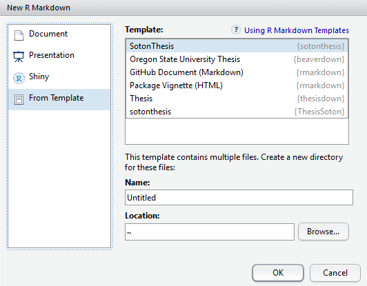
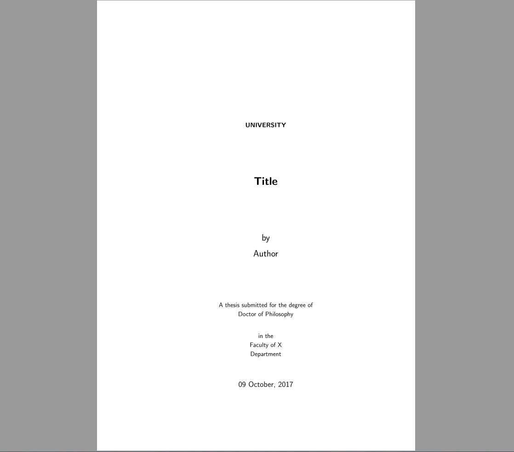

# sotonthesis

This project was inspired by the [bookdown](http://github.com/rstudio/bookdown) and [thesisdown](http://github.com/ismayc/thesisdown) packages which can be used to create books and reports within RMarkdown. This respository has updated the template and made other alterations to the code to make it suitable for the use with the Southampton University thesis template [here](https://github.com/akdiem/phd_thesis_template).

Currently, the PDF and gitbook versions are fully-functional.  The word and epub versions are developmental, have no templates behind them, and are essentially calls to the appropriate functions in bookdown.

The current output for the four versions is here:
- [PDF](https://github.com/ismayc/thesisdown_book/blob/gh-pages/thesis.pdf) (Generating LaTeX file is available [here](https://github.com/ismayc/thesisdown_book/blob/gh-pages/thesis.tex) with other files at in the [book directory](https://github.com/ismayc/thesisdown_book/tree/gh-pages).)
- [Word](https://github.com/ismayc/thesisdown_book/blob/gh-pages/thesis.docx)
- [ePub](https://github.com/ismayc/thesisdown_book/blob/gh-pages/thesis.epub)
- [gitbook](http://ismayc.github.io/thesisdown_book)

Under the hood, the Southampton University thesis template is used to ensure that documents conform precisely to submission standards. At the same time, composition and formatting can be done using lightweight [markdown](http://rmarkdown.rstudio.com/authoring_basics.html) syntax, and **R** code and its output can be seamlessly included using [rmarkdown](http://rmarkdown.rstudio.com).

Using **sotonthesis** has some prerequisites which are described below. To compile PDF documents using **R**, you are going to need to have LaTeX installed.  It can be downloaded for Windows at <http://http://miktex.org/download> and for Mac at <http://tug.org/mactex/mactex-download.html>.  Follow the instructions to install the necessary packages after downloading the (somewhat large) installer files.  You may need to install a few extra LaTeX packages on your first attempt to knit as well.

If you are installing MikTex on a university computer, you may encounter a problem with "pdflatex". It appears this is resolved by only setting MikTex to be installed for the local account within the installation.

### Using sotonthesis package:

To use **sotonthesis** from RStudio:

1) Install the latest [RStudio](http://www.rstudio.com/products/rstudio/download/). Note: if you are at Southampton university, the standard version of R provided on computers is the still version 0.99.473. You can check this in RStudio within "Help-> About RStudio"

2) Install the **bookdown** and **sotonthesis** packages: 

```S
install.packages("devtools")
devtools::install_github("rstudio/bookdown")
devtools::install_github("mikey-harper/sotonthesis")

```

3) Use the **New R Markdown** dialog to select **Thesis**:



Note that this will currently only **Knit** if you name the directory `index` as shown above.

### Customising the Template

Once you have downloaded the file, you can customise the template using the parameters within the index.Rmd

```
---
title: 'Title'
author: 'Author'
supervisor: "Supervisor"
university: "University"
department: "Department"
degree: "Doctor of Philosophy"
group: "Group"
faculty: 'Faculty of X'
date: "`r format(Sys.time(), '%d %B, %Y')`"
knit: "bookdown::render_book"
fontfamily: cmss # cmr (standard), cmss (modern) cmtt (typewriter)
site: bookdown::bookdown_site
frontmatter: true 
output:
  thesisdown::thesis_pdf: default
#  thesisdown::thesis_gitbook: default
#  thesisdown::thesis_word: default
#  thesisdown::thesis_epub: default
# If you are creating a PDF you'll need to write your preliminary content here or
# use code similar to line 20 for the files.  If you are producing in a different
# format than PDF, you can delete or ignore lines 20-31 in this YAML header.
abstract: |
# If you'd rather include the preliminary content in files instead of inline
# like below, use a command like that for the abstract above.  Note that a tab is 
# needed on the line after the |.
acknowledgements: |
  Include Acknowledgements
bibliography: "bib/thesis.bib"
biblio-style: apalike
# Download your specific bibliography database file and refer to it in the line above.
csl: csl/apa.csl
# Download your specific csl file and refer to it in the line above.
lot: true
lof: true
fontsize: 11pt
#space_between_paragraphs: true
# Delete the # at the beginning of the previous line if you'd like
# to have a blank new line between each paragraph
#header-includes:
#- \usepackage{tikz}
---
```


### Example Output

You can view the PDF output of the base template [here](thesis.pdf)

