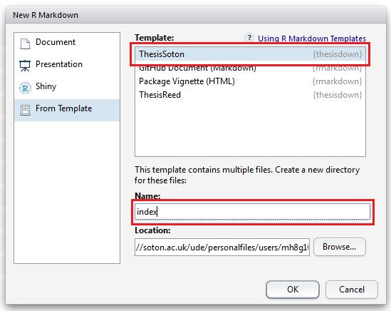

# sotonthesis

This project was inspired by the [bookdown](http://github.com/rstudio/bookdown) and [thesisdown](http://github.com/ismayc/thesisdown) packages which can be used to create books and reports within RMarkdown. This respository has updated the template and made other alterations to the code to make it suitable for the use with the Southampton University thesis template [here](https://github.com/akdiem/phd_thesis_template).

Currently, the PDF and gitbook versions are fully-functional.  The word and epub versions are developmental, have no templates behind them, and are essentially calls to the appropriate functions in bookdown.

The current output for the four versions is here:
- [PDF](https://github.com/ismayc/thesisdown_book/blob/gh-pages/thesis.pdf) (Generating LaTeX file is available [here](https://github.com/ismayc/thesisdown_book/blob/gh-pages/thesis.tex) with other files at in the [book directory](https://github.com/ismayc/thesisdown_book/tree/gh-pages).)
- [Word](https://github.com/ismayc/thesisdown_book/blob/gh-pages/thesis.docx)
- [ePub](https://github.com/ismayc/thesisdown_book/blob/gh-pages/thesis.epub)
- [gitbook](http://ismayc.github.io/thesisdown_book)

Under the hood, the Southampton University thesis template is used to ensure that documents conform precisely to submission standards. At the same time, composition and formatting can be done using lightweight [markdown](http://rmarkdown.rstudio.com/authoring_basics.html) syntax, and **R** code and its output can be seamlessly included using [rmarkdown](http://rmarkdown.rstudio.com).

Using **sotonthesis** has some prerequisites which are described below. To compile PDF documents using **R**, you are going to need to have LaTeX installed.  It can be downloaded for Windows at <http://http://miktex.org/download> and for Mac at <http://tug.org/mactex/mactex-download.html>.  Follow the instructions to install the necessary packages after downloading the (somewhat large) installer files.  You may need to install a few extra LaTeX packages on your first attempt to knit as well.

### Using thesisdown from Chester's GitHub

To use **sotonthesis** from RStudio:

1) Install the latest [RStudio](http://www.rstudio.com/products/rstudio/download/).

2) Install the **bookdown** and **thesisdown** packages: 

```S
install.packages("devtools")
devtools::install_github("rstudio/bookdown")
devtools::install_github("ismayc/thesisdown")
```

3) Use the **New R Markdown** dialog to select **Thesis**:



Note that this will currently only **Knit** if you name the directory `index` as shown above.

### Customising the Template